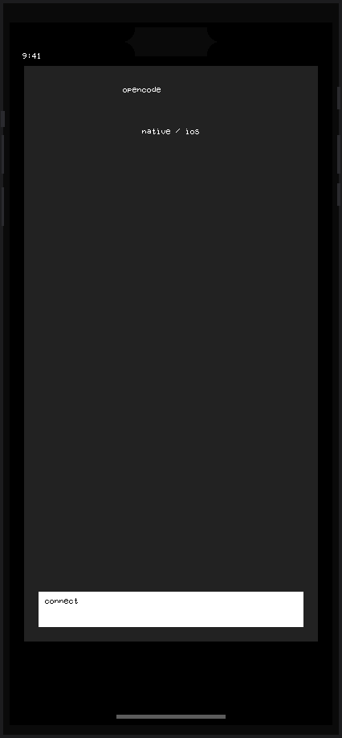
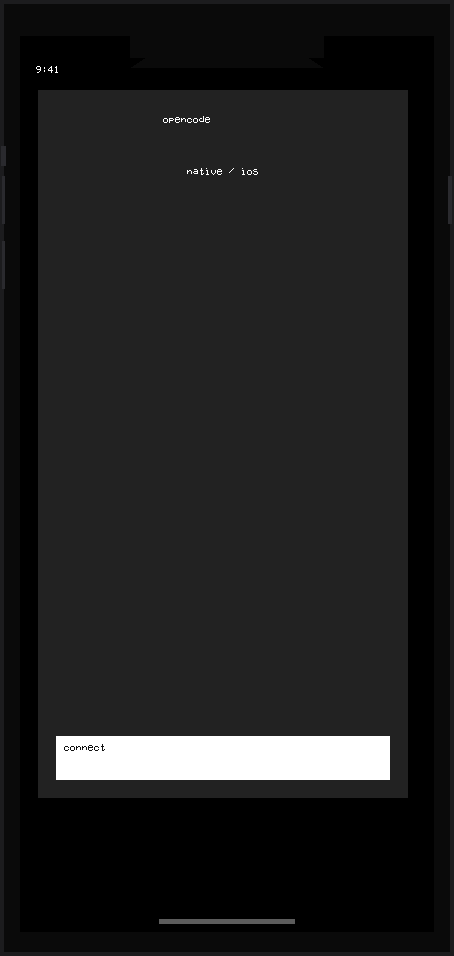
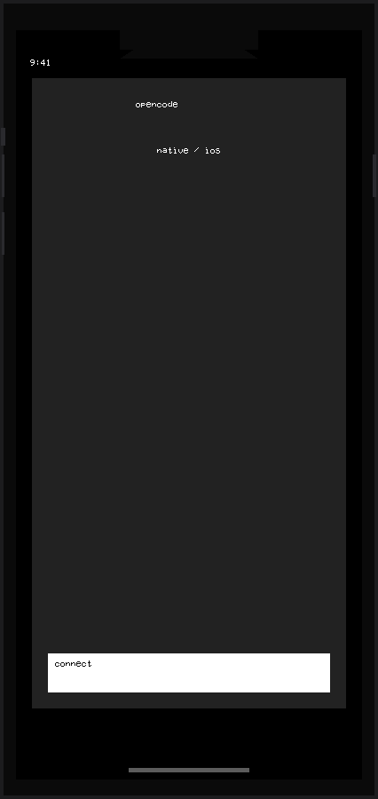

<p align="center">
  
</p>

<h1 align="center">OpenSwift</h1>

<p align="center">
  <strong>SwiftUI visual iteration without pretending to be Xcode.</strong><br>
  Pick one screen, declare the files that belong to the task, render an approximate iPhone preview, and keep every iteration as evidence a human and an agent can both inspect.
</p>

<p align="center">
  <a href="#quick-start"><strong>Quick start</strong></a>
  &nbsp;·&nbsp;
  <a href="#studio"><strong>Studio</strong></a>
  &nbsp;·&nbsp;
  <a href="#providers"><strong>Providers</strong></a>
  &nbsp;·&nbsp;
  <a href="#ui-session"><strong>.ui-session</strong></a>
</p>

---

## What OpenSwift is

OpenSwift is a lightweight visual harness for SwiftUI work.

It does **not compile Swift**. The current provider reads a useful subset of SwiftUI, builds a view tree, lays it out approximately, and emits SVG/PNG previews inside realistic iPhone frames.

The preview is only half of the idea. The other half is the session around it:

```text
intent + target + allowed files
              ↓
            render
              ↓
 preview + tree + problems + history
```

That gives a human and an agent a small, explicit workspace instead of asking either of them to reason about an entire project at once.

<p align="center">
  
  &nbsp;
  
  &nbsp;
  
</p>

<p align="center">
  <em>iPhone 11 · iPhone 14 · iPhone 16 Pro</em>
</p>

## Why it exists

Xcode Preview is excellent when Xcode is available. OpenSwift is aimed at a different workflow: quick visual feedback, Linux-friendly tooling, and reproducible UI iteration for humans and coding agents.

A session answers four questions explicitly:

- **What screen are we working on?** `target`
- **What related files belong to the task?** `allowed`
- **What is the human trying to improve?** `intent`
- **What did each iteration actually look like?** `iterations/*.png` + SHA-256

OpenSwift calls the output a **sketch** on purpose. It should be fast, inspectable, and honest about where approximation ends.

## Providers

The frontend is designed around replaceable rendering backends.

| Provider | Status | Purpose |
|---|---|---|
| `approximate-web` | ✅ active | Local SwiftUI subset → SVG + PNG, no compiler |
| `miniswift` | 🚧 named | Future browser/compiler-backed provider |
| `xcode-preview` | 🚧 named | Future native reference provider |

Today, only `approximate-web` is wired. Asking for another provider fails closed instead of silently pretending it worked.

## Quick start

```bash
# From the OpenSwift repo
cd OpenSwift

# Create a focused UI session
PYTHONPATH="." python3 -m openswift focus examples/hello.swift \
  --allow Theme.swift \
  --allow ModelPicker.swift \
  --intent "make the panel feel less cramped"

# Render one iteration
PYTHONPATH="." python3 -m openswift render --device iphone-16-pro

# Inspect the session
PYTHONPATH="." python3 -m openswift status
```

Example status:

```text
target: /home/danny/.../OpenSwift/examples/hello.swift
provider: approximate-web
allowed: Theme.swift, ModelPicker.swift
read only: everything except target and allowed
iteration: 1
session: /home/danny/.../.ui-session
intent: make the panel feel less cramped
```

Each render adds another snapshot such as `iterations/001.png`, `002.png`, `003.png` so feedback can refer to concrete visual states.

## Studio

OpenSwift has two interactive surfaces that use the same sketch engine.

### Desktop app

The Tauri app provides:

- project/file navigator
- Swift editor
- syntax highlighting through the pinned `msf` lexer
- device selector
- live iPhone preview
- Debugger / Output / Problems / Console panes
- `Ctrl+Enter` to render
- `Ctrl+S` to save

```bash
cd app
npm install
npm run tauri dev
```

Build a `.deb` with:

```bash
npm run tauri build
```

### Local web Studio

```bash
PYTHONPATH="/path/to/OpenSwift" \
  python3 -m openswift studio /path/to/your/project --port 8765
```

Then open `http://127.0.0.1:8765`.

The local server only accepts its expected localhost host/origin and JSON POSTs. This blocks common cross-site and DNS-rebinding-style attempts to drive a write-capable local tool from an unrelated browser page.

## Commands

```bash
# Draw a standalone SVG without creating a session
PYTHONPATH="." python3 -m openswift draw examples/hello.swift \
  -o /tmp/hello.svg --device iphone-15

# Create a session
PYTHONPATH="." python3 -m openswift focus path/to/View.swift \
  --allow Dependency.swift \
  --intent "reduce visual density" \
  --provider approximate-web

# Render the active session
PYTHONPATH="." python3 -m openswift render --device iphone-14

# Inspect session state
PYTHONPATH="." python3 -m openswift status

# Produce tooling-friendly JSON
PYTHONPATH="." python3 -m openswift sketch examples/hello.swift --device iphone-12
```

Supported device frames:

`iphone-11` · `iphone-12` · `iphone-13` · `iphone-14` · `iphone-14-plus` · `iphone-14-pro` · `iphone-15` · `iphone-16` · `iphone-16-pro`

## `.ui-session`

A focused session is just files on disk:

```text
.ui-session/
├── target.json
├── intent.md
├── source.swift
├── preview.svg
├── preview.png
├── preview.sha256
└── iterations/
    ├── 001.png
    ├── 001.sha256
    ├── 002.png
    └── 002.sha256
```

`target.json` records the target, the explicitly allowed related files, provider metadata, iteration number, and the hash of the latest preview.

The session is intentionally plain and inspectable. There is no hidden project database and no proprietary workspace format.

## What the renderer understands

| SwiftUI surface | Current behavior |
|---|---|
| `VStack` / `HStack` / `ZStack` | ✅ approximate layout |
| `Text` / `Button` | ✅ text, size, color, weight |
| `Spacer` / `Divider` | ✅ |
| `TextField` / `SecureField` / `Label` / `Image` | ✅ labeled placeholder box |
| `Form` / `Section` / `List` / `ScrollView` | ✅ vertical containers |
| `NavigationStack` / `Group` / `GroupBox` | ✅ |
| `.font(.system(size:weight:))` | ✅ |
| `.foregroundColor` / `.foregroundStyle` | ✅ color + opacity |
| `.background` / `.padding` / `.cornerRadius` | ✅ |
| `.frame(height: / maxWidth: .infinity)` | ✅ |
| `.sheet`, bindings, animation, runtime state | ⚠️ reported as unsupported/ignored |
| custom/external views | ⚠️ rendered as labeled boxes |

Unsupported syntax is surfaced through **Problems** rather than silently presented as if it were fully faithful SwiftUI.

## Tests

```bash
PYTHONPATH="." python3 -m unittest discover -s tests
```

The suite covers preview generation, session behavior, Studio requests, and local-server security checks.

## Credits and provenance

OpenSwift can color Swift source using the lexer from [`msf`](https://github.com/toprakdeviren/msf) by Toprakdeviren (MIT).

The dependency is fetched only by `tools/build-lex.sh`, pinned to an exact commit, and is not vendored into this repository. See [`NOTICE.md`](NOTICE.md) for the pinned revision and distribution notes.

MiniSwift inspired the idea of getting useful Swift feedback without requiring the full Xcode workflow. OpenSwift does not include MiniSwift code; `miniswift` is currently only a future provider name.

---

<p align="center">
  
  
  
</p>

<p align="center">
  Built for reproducible UI iteration between humans and agents.<br>
  MIT License.
</p>
