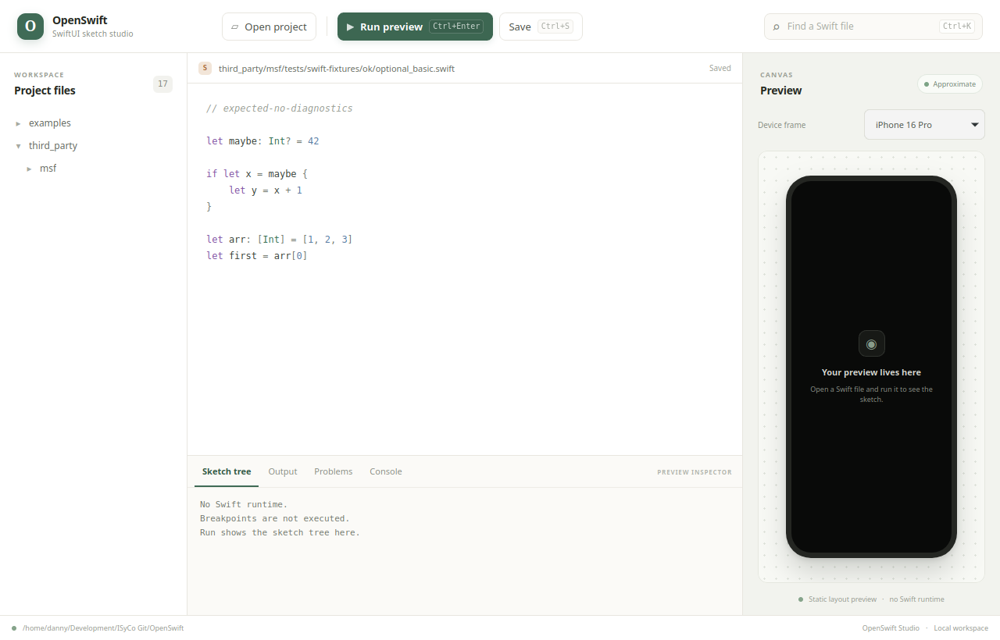

<p align="center">
  
</p>

<h1 align="center">OpenSwift</h1>

<p align="center">
  <strong>Una mesa compartida para diseñar una pantalla SwiftUI.</strong><br>
  Un sketch local, una sesión con límites claros y una preview que humanos y agentes pueden revisar juntos.
</p>

<p align="center">
  <a href="#empieza-en-un-minuto">Empieza</a> ·
  <a href="#studio">Studio</a> ·
  <a href="#qué-dibuja">Qué dibuja</a> ·
  <a href="#desarrollo">Desarrollo</a>
</p>

<p align="center">
  
  
  
</p>

---

## Qué es

OpenSwift convierte una parte reconocible de SwiftUI —stacks, texto, botones y algunos modificadores— en un **bosquejo visual** dentro de un marco de iPhone. No compila ni ejecuta Swift. Sirve para hablar de una pantalla y probar cambios de layout sin abrir Xcode.

La pieza central es la sesión `.ui-session`: fija una vista, guarda la intención, registra previews con hashes SHA-256 y, mientras la sesión está activa, limita los guardados de Studio al archivo `target` y a los archivos `allowed`. Así la persona y el agente pueden iterar sobre el mismo objetivo y ver qué cambió.

<p align="center">
  
</p>

<p align="center">
  
  &nbsp;
  
  &nbsp;
  
</p>

## Empieza en un minuto

Necesitas Python 3.10 o posterior. El CLI usa la biblioteca estándar de Python.

```bash
git clone https://github.com/DannyBaanks/OpenSwift.git
cd OpenSwift

# Abre una sesión para el ejemplo incluido
PYTHONPATH="$PWD" python3 -m openswift focus examples/hello.swift \
  --intent "darle más aire al panel"

# Genera la preview y consulta la sesión
PYTHONPATH="$PWD" python3 -m openswift render --device iphone-16-pro
PYTHONPATH="$PWD" python3 -m openswift status
```

Cada render guarda otra iteración en `.ui-session/iterations/`. La preview actual queda en `.ui-session/preview.png` y su SVG en `.ui-session/preview.svg`.

Para cerrar la sesión, elimina `.ui-session/target.json` cuando ya no necesites el límite de escritura. Los archivos de evidencia de la sesión se conservan.

## Studio

### App de escritorio

La app de escritorio usa Tauri 2, Bun, Rust y Python 3. Desde la raíz del clon:

```bash
cd app
bun install
bun run tauri dev
```

Abre una carpeta de proyecto, elige un archivo `.swift` y pulsa **Run**. **Save** escribe los cambios en el archivo abierto; `Ctrl+S` guarda y `Ctrl+Enter` vuelve a dibujar. La app no ejecuta breakpoints ni compila Swift.

Para compilar los paquetes disponibles en tu plataforma:

```bash
bun run tauri build
```

En Linux se generan los paquetes disponibles, incluido `.deb`, `.rpm` y AppImage. En Windows, Tauri integra `icon.ico` en el ejecutable y usa los paquetes nativos disponibles. La compilación requiere las dependencias nativas de desarrollo de Tauri. Consulta la guía de Tauri para los requisitos de tu sistema.

### Studio web local

Desde la raíz de OpenSwift, apunta `PYTHONPATH` al clon y pasa la carpeta del proyecto que quieras abrir:

```bash
OPENSWIFT_DIR="$PWD"
PYTHONPATH="$OPENSWIFT_DIR" python3 -m openswift studio \
  "/ruta/a/tu/proyecto" --port 8765
```

Abre `http://127.0.0.1:8765`. El servidor sólo acepta los hosts locales esperados, bloquea orígenes externos y comprueba que las rutas permanezcan dentro del proyecto. Si hay una `.ui-session/target.json`, también aplica su lista de escritura permitida.

## CLI

```bash
# Dibujar un SVG sin crear sesión
PYTHONPATH="$PWD" python3 -m openswift draw examples/hello.swift \
  --device iphone-15 --output /tmp/hello.svg

# Revisar el árbol como JSON
PYTHONPATH="$PWD" python3 -m openswift sketch examples/hello.swift \
  --device iphone-12

# Ver las opciones disponibles
PYTHONPATH="$PWD" python3 -m openswift --help
```

Dispositivos incluidos: `iphone-11`, `iphone-12`, `iphone-13`, `iphone-14`, `iphone-14-plus`, `iphone-14-pro`, `iphone-15`, `iphone-16` e `iphone-16-pro`.

## Qué dibuja

| SwiftUI | Resultado aproximado |
|---|---|
| `VStack`, `HStack`, `ZStack` | Layout básico y espaciado |
| `Text`, `Button` | Texto, tamaño, peso y color básico |
| `Spacer`, `Divider` | Separación y divisor |
| `TextField`, `SecureField`, `Label`, `Image` | Caja etiquetada |
| `Form`, `Section`, `List`, `ScrollView` | Contenedores verticales |
| `NavigationStack`, `Group`, `GroupBox` | Contenedores del sketch |
| Padding, fondo, radio de esquina y frame sencillo | Modificadores compatibles del preview |
| `.sheet`, `.overlay`, bindings, animaciones y vistas propias | No se ejecutan; pueden aparecer como cajas o avisos |

La salida ayuda a conversar sobre composición y proporciones. No representa fielmente el comportamiento, tipografía ni layout final de SwiftUI en iOS.

## Sesiones y límites

Una sesión guarda:

```text
.ui-session/
├── target.json       # objetivo, permitidos, proveedor e iteración
├── intent.md         # objetivo expresado en palabras
├── source.swift      # copia de referencia
├── preview.svg       # último sketch vectorial
├── preview.png       # último sketch rasterizado
├── preview.sha256    # hash de la preview PNG
└── iterations/       # previews anteriores y sus hashes
```

Studio bloquea las escrituras fuera de `target` y `allowed` mientras exista `target.json`. El límite se aplica al guardar desde Studio; no es un sandbox del sistema operativo ni restringe herramientas externas que editen archivos directamente.

## Providers

| Provider | Estado |
|---|---|
| `approximate-web` | Activo; dibuja SVG y PNG localmente |
| `miniswift` | Nombre reservado; todavía no está conectado |
| `xcode-preview` | Nombre reservado; todavía no está conectado |

## Desarrollo

```bash
PYTHONPATH="$PWD" python3 -m unittest discover -s tests
```

El editor puede usar el lexer [msf](https://github.com/toprakdeviren/msf) para colorear Swift. Es opcional: para compilarlo se requiere Git y un compilador C:

```bash
./tools/build-lex.sh
```

El código de msf no está incluido en el repositorio. Está fijado a un commit y su licencia/procedencia se documenta en [NOTICE.md](NOTICE.md).

El icono maestro está en `app/src-tauri/icons/openswift-icon.svg`. Para regenerar los iconos multiplataforma después de editarlo:

```bash
cd app
bun run tauri icon ./src-tauri/icons/openswift-icon.svg --output ./src-tauri/icons
```

## Guías

- [Guía práctica en español](GUIA.md)
- [Aviso de terceros](NOTICE.md)
- [Licencia MIT](LICENSE)

---

<p align="center">Hecho para que humanos y agentes puedan mirar la misma pantalla y hablar de cambios concretos.</p>
